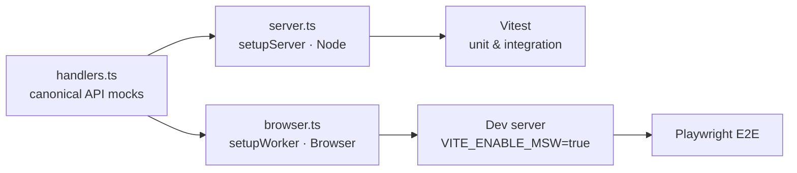

# Post Explorer — Automated Testing Demo

A small **React + TypeScript** single-page application that consumes the public
[JSONPlaceholder](https://jsonplaceholder.typicode.com/) API, built specifically
to **demonstrate a complete automated testing strategy** for front-end projects.

Every layer of the testing pyramid is covered with modern, industry-standard
tooling:

| Testing Layer          | Default Tool(s)                              | Primary Role                                                                       |
| :--------------------- | :------------------------------------------- | :--------------------------------------------------------------------------------- |
| **Unit & Integration** | **Vitest** + **React Testing Library (RTL)** | Testing components and logic in isolation, quickly and reliably.                   |
| **API Mocking**        | **Mock Service Worker (MSW)**                | Intercepting network requests to test components that fetch data.                  |
| **End-to-End (E2E)**   | **Playwright**                               | Testing critical user flows in a real browser across Chromium, Firefox and WebKit. |

---

## Features

The app is a **Post Explorer** backed by the JSONPlaceholder API:

- Paginated post list (`10` posts per page via `_start` / `_limit`)
- **"Load more posts"** button that appends the next page
- **Live search** that filters posts by title as you type
- **Detail view** for a single post (`/posts/:id`), fetched on demand
- **Loading states** (accessible, with `role="status"`)
- **Error states** with a **"Try again"** retry action (accessible, with `role="alert"`)

The UI is deliberately simple (plain CSS, dark theme, no UI framework) so the
focus stays on **how the application is tested**.

---

## Tech Stack

| Area               | Technology                                             |
| :----------------- | :----------------------------------------------------- |
| Framework          | React 19                                               |
| Language           | TypeScript (strict mode)                               |
| Build tool         | Vite                                                   |
| Unit / Integration | Vitest + React Testing Library + jest-dom + user-event |
| API mocking        | Mock Service Worker (MSW) 2.x                          |
| E2E                | Playwright (Chromium, Firefox, WebKit)                 |
| Coverage           | Vitest Coverage (`@vitest/coverage-v8`)                |

---

## Project Structure

```
.
├── e2e/
│   └── posts.spec.ts              # Playwright end-to-end tests
├── public/
│   └── mockServiceWorker.js       # MSW service worker (browser interception)
├── src/
│   ├── api/
│   │   ├── posts.ts               # API layer (fetch, errors, pagination)
│   │   └── posts.test.ts          # Unit tests for the API layer
│   ├── components/
│   │   ├── PostsList.tsx          # Paginated + searchable list
│   │   ├── PostCard.tsx           # Single post teaser
│   │   ├── PostDetail.tsx         # Detail view
│   │   ├── LoadingState.tsx       # Accessible loading indicator
│   │   └── ErrorState.tsx         # Accessible error + retry
│   ├── mocks/
│   │   ├── handlers.ts            # Canonical MSW handlers + mock data
│   │   ├── server.ts              # Node server (Vitest) — setupServer
│   │   └── browser.ts             # Browser worker (dev/E2E) — setupWorker
│   ├── test/
│   │   ├── setup.ts               # jest-dom + MSW server lifecycle
│   │   └── utils.tsx              # Shared render helper
│   ├── types/
│   │   └── post.ts                # Post type
│   ├── App.tsx                    # Root component (state-based navigation)
│   └── main.tsx                   # Entry point (conditional MSW start)
├── playwright.config.ts           # E2E configuration
├── vite.config.ts                 # Vite + Vitest configuration
└── package.json
```

---

## Getting Started

### Prerequisites

- **Node.js 20.19+ or 22.12+** (LTS recommended)
- npm (bundled with Node.js)
- Playwright browsers (install once: `npm run test:e2e:install`)

### Install

```bash
npm install
```

### Run the app

```bash
npm run dev
```

Open http://localhost:5173. The app calls the real JSONPlaceholder API.

> **Tip:** run with the MSW worker to get a fully offline, deterministic app:

```bash
VITE_ENABLE_MSW=true npm run dev
```

---

## Testing

### Quick reference

| Command                    | Description                                               |
| :------------------------- | :-------------------------------------------------------- |
| `npm run test`             | Runs all unit & integration tests once (Vitest)           |
| `npm run test:watch`       | Runs unit & integration tests in watch mode               |
| `npm run test:coverage`    | Runs tests and generates a coverage report (`coverage/`)  |
| `npm run test:e2e`         | Runs the Playwright E2E suite (Chromium, Firefox, WebKit) |
| `npm run test:e2e:ui`      | Opens the Playwright UI (debug, trace, run single tests)  |
| `npm run test:e2e:install` | Installs the Playwright browsers (first time only)        |

### 1. Unit & Integration — Vitest + React Testing Library

Unit tests verify isolated pieces of logic; integration tests render real
components and exercise real user interactions.

```bash
npm run test          # once
npm run test:watch    # watch mode
npm run test:coverage # with coverage report
```

Coverage thresholds today (from `src/`):

| Metric     | Value |
| :--------- | :---- |
| Statements | ~95%  |
| Branches   | ~87%  |
| Functions  | ~92%  |
| Lines      | ~96%  |

Tests live **co-located** with the code they test (e.g. `src/api/posts.test.ts`,
`src/components/PostsList.test.tsx`). The report is written to `coverage/`
(open `coverage/index.html` in a browser for the full HTML report).

### 2. API Mocking — Mock Service Worker (MSW)

MSW intercepts network requests at the service-worker level (browser) or
protocol level (Node), so components that fetch data can be tested without a
real backend — **and without mocking `fetch` by hand**.

The **canonical handlers live in one file**, `src/mocks/handlers.ts`, and are
reused in three places:

| Environment | Entry point            | What it does                                                         |
| :---------- | :--------------------- | :------------------------------------------------------------------- |
| Vitest      | `src/mocks/server.ts`  | Node `setupServer` — started/stopped in `src/test/setup.ts`          |
| Dev browser | `src/mocks/browser.ts` | Browser `setupWorker` — started when `VITE_ENABLE_MSW=true`          |
| E2E         | `src/mocks/browser.ts` | Same worker — Playwright starts the dev server with the env flag set |

Key behaviours of the mock API:

- **Deterministic dataset**: 25 canonical posts (`Mock post 1: …` … `Mock post 25: …`)
- **Pagination**: honours `_start` / `_limit`, exactly like the real API
- **Latency simulation**: a configurable `networkDelay` (0 in tests, ~300ms in the browser) so loading states are actually exercised
- **Error scenarios**: `GET /posts/:id` returns 404 for unknown ids; tests can override handlers per-test with `server.use(...)`

### 3. End-to-End — Playwright

E2E tests run in **real browsers** (Chromium, Firefox, WebKit) against the real
dev server, exercising complete user flows: load → search → navigate → retry.

```bash
npm run test:e2e:install  # first time only: download browsers
npm run test:e2e          # run the suite
npm run test:e2e:ui       # interactive UI
```

Because the dev server is started with `VITE_ENABLE_MSW=true` (see
`playwright.config.ts`), the **MSW worker serves every API response during E2E
runs** — tests are fast, deterministic and never depend on the public API being
up.

E2E scenarios (`e2e/posts.spec.ts`):

1. Loads the first page and shows the post count
2. Navigates list → detail → back
3. Filters posts with the search box
4. Simulates a backend outage and verifies the user can retry and recover

> The outage scenario uses a small control surface the app exposes on `window`
> (`__mswFailPosts` / `__mswReset`) — see `src/mocks/browser.ts`. It exists only
> when the MSW worker is active.

---

## How the MSW "single source of truth" works



One set of handlers → three execution environments → consistent behaviour
everywhere the app runs.

---

## Configuration

| Variable            | Default                                | Purpose                                    |
| :------------------ | :------------------------------------- | :----------------------------------------- |
| `VITE_ENABLE_MSW`   | _(unset)_                              | When `true`, starts the MSW browser worker |
| `VITE_API_BASE_URL` | `https://jsonplaceholder.typicode.com` | Base URL for the API layer                 |

Example:

```bash
VITE_ENABLE_MSW=true VITE_API_BASE_URL=http://localhost:8080 npm run dev
```

---

## Scripts

| Script                     | Description                              |
| :------------------------- | :--------------------------------------- |
| `npm run dev`              | Start the Vite dev server                |
| `npm run build`            | Type-check (`tsc -b`) + production build |
| `npm run preview`          | Preview the production build locally     |
| `npm run lint`             | Lint with Oxlint                         |
| `npm run test`             | Unit & integration tests (Vitest, once)  |
| `npm run test:watch`       | Unit & integration tests (watch mode)    |
| `npm run test:coverage`    | Tests + coverage report (`coverage/`)    |
| `npm run test:e2e`         | Playwright E2E suite (all browsers)      |
| `npm run test:e2e:ui`      | Playwright interactive UI                |
| `npm run test:e2e:install` | Install Playwright browsers              |

---

## Troubleshooting

| Problem                                   | Fix                                                                                                                                            |
| :---------------------------------------- | :--------------------------------------------------------------------------------------------------------------------------------------------- |
| `Executable doesn't exist ... playwright` | Run `npm run test:e2e:install` to download the browsers.                                                                                       |
| Port `5173` already in use                | Kill the process or change the port in `playwright.config.ts` (both `use.baseURL` and `webServer.url`).                                        |
| MSW worker warnings in the console        | Make sure `public/mockServiceWorker.js` exists (regenerate with `npx msw init public/`) and you're running `VITE_ENABLE_MSW=true npm run dev`. |
| E2E hits the real API                     | The dev server **must** be started with `VITE_ENABLE_MSW=true` (Playwright does this automatically via `webServer.command`).                   |
| Vitest shows `onUnhandledRequest` errors  | Tests only: a request went outside the handlers — add a handler in `src/mocks/handlers.ts` or fix the URL.                                     |

---

## License

MIT — use it, learn from it, test everything.
